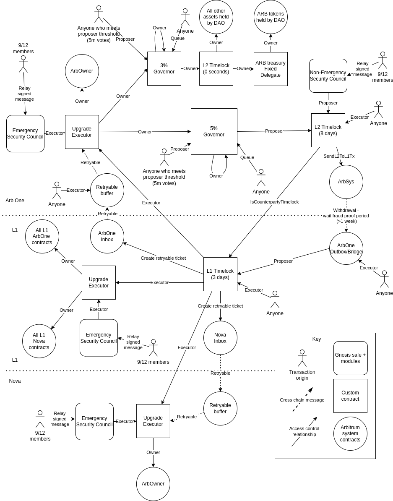

# Arbitrum Governance

> See here for alternative [high level overview](https://docs.arbitrum.foundation/concepts/lifecycle-anatomy-aip-proposal) 

Arbitrum governance has two main bodies:

- **The DAO** - represented by holders of the $ARB token, and votes to pass proposals.
- **The Security Council** - is made up of a 9 of 12 multisig that can take quick action in case of an emergency and a 7 of 12 multisig that can take slow action for routine upgrades that bypass the DAO vote.

You can read more about these bodies and their powers in the [Arbitrum DAO Constitution](https://docs.arbitrum.foundation/dao-constitution).

## Invariants

- Only passed proposals made through the constitutional governor (the DAO) or a Security Council can upgrade the system.
- All proposals, except those done by a 9/12 Security Council will go through 3 delays: L2 timelock, withdrawal delay, L1 timelock. The 9/12 Security Council should be able to make an upgrade without any delay.
- Once a proposal has been passed, there is always time for a user to exit any assets they have on Arbitrum One or Nova before the proposal is executed
- A proposal cannot be canceled or blocked, except by the Security Council.
- Once a proposal has been passed, anyone can ensure its full execution through all stages.

## Assets under governance

Governance is responsible for the following assets:

- **Treasury** - a portion of the tokens allocated to the DAO.
- **Arb One contracts** - these contracts are deployed on Ethereum Mainnet. Governance holds upgradability rights over these contracts.
- **Arb Nova contracts** - these contracts are deployed on Ethereum Mainnet. Governance holds upgradability rights over these contracts.
- **Arb One L2 parameters** - All Arbitrum chains have a chain "owner" that can set certain parameters. Read more [here](https://github.com/OffchainLabs/nitro/blob/master/precompiles/ArbOwner.go). Governance has control over the chain owner.
- **Arb Nova L2 parameters** - same as Arb One L2 parameters.
- **Governance contracts** - Governance has the ability to upgrade and modify itself.
- **Arbitrum Foundation Administrative Budget Wallet** — see [here](./foundation-vesting-wallet.md) for info.

## Proposal types

Governance has the ability to upgrade both Arbitrum One and Arbitrum Nova, which could affect the users of those chains. Any proposal executed by the Arbitrum DAO goes through a number of stages, each with different time delays, ensuring that any users who disagree with an upgrade will have the opportunity to exit the chain before it takes effect.

The exception to this is proposals that are deemed _non-constitutional_. This type of proposal shouldn't affect the behavior of the chain, or should do so in limited well understood ways. At inception the only type of non-constitutional proposal is the spending of treasury funds.

To differentiate between these two types of proposal, Arbitrum governance uses two Governor contracts. A _constitutional_ one which requires at least 5% of all votable tokens to vote “in favor” and more votable tokens to vote “in favor” than to vote “against” in order to pass, and a _non-constitutional_ one which requires at least 3% of all votable tokens to vote “in favor” and more votable tokens to vote “in favor” than to vote “against” in order to pass. The ability to upgrade Arbitrum contracts is held by the 5% governor, so no proposals made from the 3% governor can cause a change to contract code, or to a set of chain “owner” parameters.

## Proposal delays

All governance activities occur on Arbitrum One. Proposals are made there, as well as delegation and voting. A proposal made to the constitutional governor experiences enough delay to ensure that users can safely exit the chain before the proposal is executed, should they deem it malicious.

1. **Arbitrum One timelock** - 3 days delay. After passing, a proposal is delivered to a timelock on Arbitrum One. The purpose of this delay is to allow users to initiate withdrawals from the chain should they wish to.
2. **L2->L1 message delay** - ~1 week. All proposals must be withdrawn to L1 before being executed (even if they will eventually execute back on an L2). This ensures that any exits made by users in the previous delay can be processed before the upgrade will, since both go through this delay.
3. **Ethereum mainnet delay** - 3 days. Withdrawals are delayed by any open challenges in the Arbitrum One rollup. This can cause many withdrawals to become eligible for execution on L1 at the same time. This would mean that although a user initiated their withdrawal before the L2->L1 upgrade message, they could both become eligible for execution on the L1 at roughly the same time, causing users to race on L1 against the upgrade. To prevent this, the upgrade proposal goes through a further delay after reaching the L1, ensuring that any withdrawals initiated before the upgrade proposal will be eligible for execution first.

Once the proposal has gone through each of these delays, it is then directed to the target of its execution, which could be on any of Arbitrum One, Nova or Ethereum mainnet. When the target is on an L2, the proposal will contain information for forming the correct L1->L2 message.

## Token

Three instances of the $ARB token are currently deployed, each on a different network: Arbitrum One, Arbitrum Nova, and Ethereum Mainnet.

The total supply of the token is tracked by the Arbitrum One instance of the token, the total supply of the token on other networks is not representative of the actual total supply. The Arbitrum One instance also allows the minting of up to 2% of the total supply once per year.

##### Vote Exclusion
Token holders have the ability to exclude their votes from the governance quorum calculations by delegating to a designated "exclude address," address `0xA4b86`. Delegating to the exclude address prevents tokens that are not expected to participate in governance from "artificially" inflating the required quorum size. For example, the treasury should not use its own tokens to vote on proposals, thus, the treasury's votes are delegated to the exclude address.      

## Governance contracts overview

Lets dive a bit deeper into each of the individual contracts, and describe more specifically the role each of the plays in the system.

#### Arbitrum One 3% Governor

The _non-constitutional_ governor, proposals made require at least 3% of all votable tokens to vote “in favor” and more votable tokens to vote "in favor" than to vote "against" in order to pass. Currently only has the power to spend funds in the treasury.

#### Arbitrum One 5% Governor

The _constitutional_ governor, proposals made require at least 5% of all votable tokens to vote "in favor" and more votable tokens to vote “in favor" than to vote "against" in order to pass.
 

_Comparison Table_
| Contract | Proposal Type | Limits |
| -------- | ------------- | ------ |
| Arb One 3% Governor | non-constitutional | only treasury-related proposals |
| Arb One 5% Governor | constitutional | - |

#### Arbitrum One L2 Timelock

Proposals can be scheduled here by the 5% governor, or by a 7-of-12 agreement in the Security Council. This timelock enforces a 3-day delay before the proposal can then be executed by anybody.

#### L1 Timelock

This timelock receives proposals that were executed in the Arb One L2 Timelock. In order for the L2 Timelock to schedule proposals in the L1 timelock it must send an L2->L1 message. Upon receiving this message the L1 timelock checks that the sender was L2 timelock on Arbitrum One, and only allows that contract to schedule proposals. This timelock then enforces a 3-day delay before allowing anybody to execute it.

 

_Comparison Table_
| Contract | Receive proposals scheduled by | Timelock |
| -------- | ------------------------------ | ----------------- |
| Arb One L2 Timelock (Arb1TL) | the 5% governor / 7-12 in Security Council | 3 days |
| L1 Timelock | proposals executed in the Arb1TL | 3 days |

#### L1 Upgrade Executor

The L1 Upgrade Executor is the owner of Arbitrum One and Nova related contracts that exist on Ethereum mainnet. It has the rights to upgrade these contracts, as well as some special ownership powers. All upgrades to these contracts must be executed through the L1 upgrade Executor. Only the Security Council and the L1 Timelock have the rights to call the Upgrade Executor.

#### Arbitrum One Upgrade Executor

The Arbitrum One Upgrade Executor is the Arbitrum One chain "owner", and also has the rights to change settings in and upgrade governance. Only the Arbitrum One Security Council and the L1 Timelock (via a retryable ticket) have the rights to execute proposals via the Arbitrum One Upgrade Executer.

#### Arbitrum Nova Upgrade Executor

The Arbitrum Nova Upgrade Executor is the Arbitrum Nova chain "owner". Only the Arbitrum Nova Security Council and the L1 Timelock (via a retryable ticket) have the rights to execute proposals via the Arb Nova Upgrade Executer.

 

_Comparison Table_
| Contract | Owner of | Who has the rights to call it? |
| -------- | -------- | ------------------------------ |
| L1 Upgrade Executor | Arbitrum One and Nova-related contracts on L1 | L1 Timelock, and the Security Council |
| Arbitrum One Upgrade Executor | Arbitrum One chain, and governance | L1 Timelock, and the Arbitrum One Security Council |
| Arbitrum Nova Upgrade Executor | Arbitrum Nova chain | L1 Timelock, and the Arbitrum Nova Security Council |

#### Arbitrum DAO Constitution

The Arbitrum DAO Constitution contract stores the hash of the canonical text of the Constitution. 
To upgrade the Constitution, a proposal should be created which calls `ArbitrumDAOConstitution.setConstitutionHash` with the new content hash. The proposal's "description" field should read:

> Update the Constitution hash to be the keccak256 hash of the following text: 
> "... Constitution text etc ..."

If keccak256 hash of the new Constitution text doesn't match the provided hash, the DAO should reject the proposal. 

## Overall configuration

Putting it all together we get a picture of the connections between all the components, and where they reside on Arbitrum One, Nova and Ethereum Mainnet.

 .

Executing a passed proposal takes a number of transactions; when a new transaction is required these are represented by a stick figure. Round objects in the diagram above represent contracts that already exist in the Arbitrum system. These are not introduced by governance, but instead are either used by governance or owned by governance.

#### Proposal lifecycle

The contracts in the diagram encode ownership chains that ensure only governance or the Security Council have the rights to upgrade Arbitrum contracts. The path that the proposal will take through these contracts is defined in the proposal itself. As the proposal moves through each stage of the path, a layer of the proposal data is unwrapped; the unwrapped data defines which contract should be called next.

This means that forming a proposal involves working backwards from the target, wrapping the data multiple times to define the path the upgrade will take.

You can read more about how the path is encoded in the [proposal lifecycle document](./proposal_lifecycle_example.md)

## Proposal Cancellation 
Both governor contracts have the affordance to cancel proposals scheduled in the L2 Timelock. The Security Council can likewise cancel proposals [via calling L2ArbitrumGovernor.relay](src/gov-action-contracts/governance/CancelTimelockOperation.sol).

## Future DAO-Governed Chains
When a [new L2 chain is authorized by the DAO](https://docs.arbitrum.foundation/new-arb-chains), the following steps should be carried out for the new chain to become DAO-governed:
1. Deploy a new UpgradeExecutor contract and a new Security Council on the new L2 chain. The Security Council multisig should be deployed with the same signers as all of the other Security Council multisigs. 
1. Initialize the new L2 UpgradeExecutor with the L1 Timelock's aliased addressed and the new Security Council as its executors.
1. Ownership transfer: for a chain deployed whose contract deployment mirrors that of Arbitrum One and Arbitrum Nova (i.e, [Nitro](https://github.com/OffchainLabs/nitro) core contracts and [token bridge contracts](https://github.com/OffchainLabs/token-bridge-contracts)), the following ownership transfer should take place:
     - The L1 Upgrade Executor should be granted the following affordances:
        - L1 core contract Proxy Admin owner
        - L1 token bridge Proxy Admin owner
        - Rollup Admin owner
        - L1 Gateway Router owner 
        - L1 Arb Custom Gateway Owner
    - The new L2 Upgrade Executor should be granted the following affordances:
        - L2 token bridge Proxy Admin Owner 
        - Chain Owner
        - Standard Arb-ERC20 Beacon Proxy owner
1. Opt in to Security Council Elections:
    1. Deploy a new UpgradeExecRouteBuilder with the new full list of Upgrade Executor locations (i.e., all the previous ones plus that of the new chain).
    1. **Via DAO proposal**: Update all references to the UpgradeExecRouteBuilder to the new address (as of writing, only referenced in `SecurityCouncilManager`).  
    1. **Via DAO proposal**: Add new Security Council to SecurityCouncilManager.
