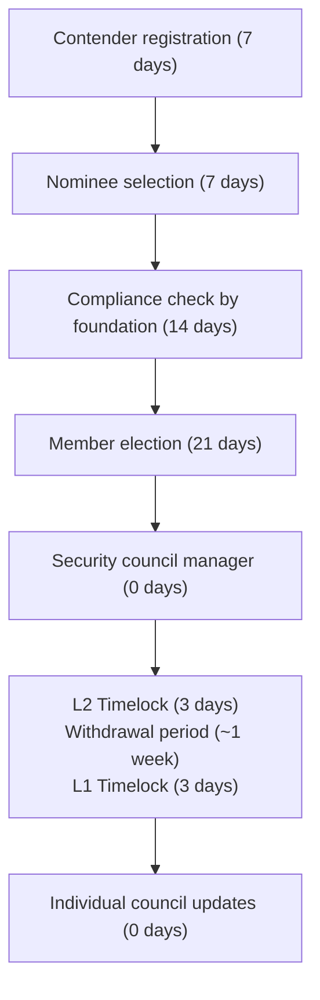

# Security Council Election Flow

```mermaid
graph TD
    Z["Contender registration (7 days)"] --> A
    A["Nominee selection (7 days)"] --> B["Compliance check by foundation (14 days)"]
    B --> C["Member election (21 days)"]
    C --> D["Security council manager (0 days)"]
    D --> E["L2 Timelock (3 days)\nWithdrawal period (~1 week)\nL1 Timelock (3 days)"]
    E --> F["Individual council updates (0 days)"]
```